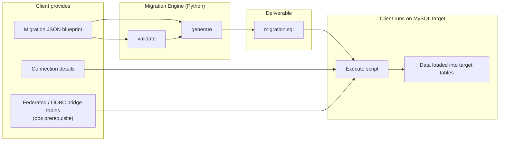
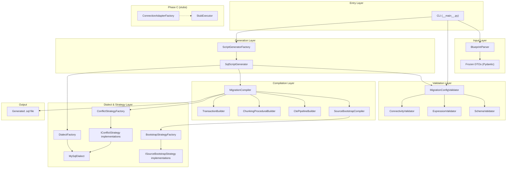
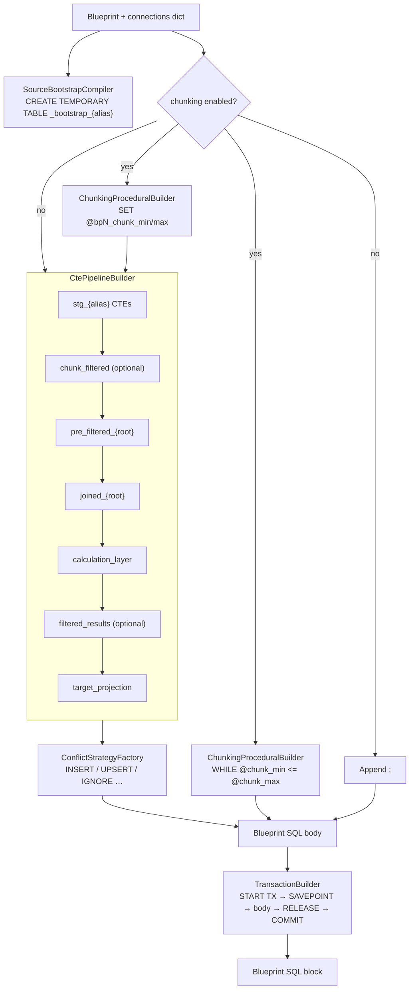
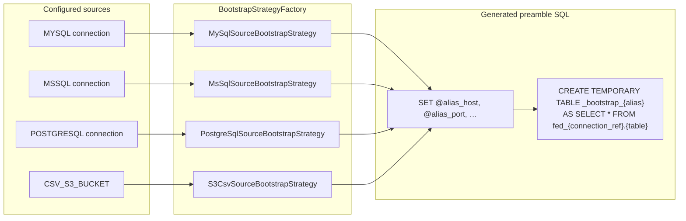
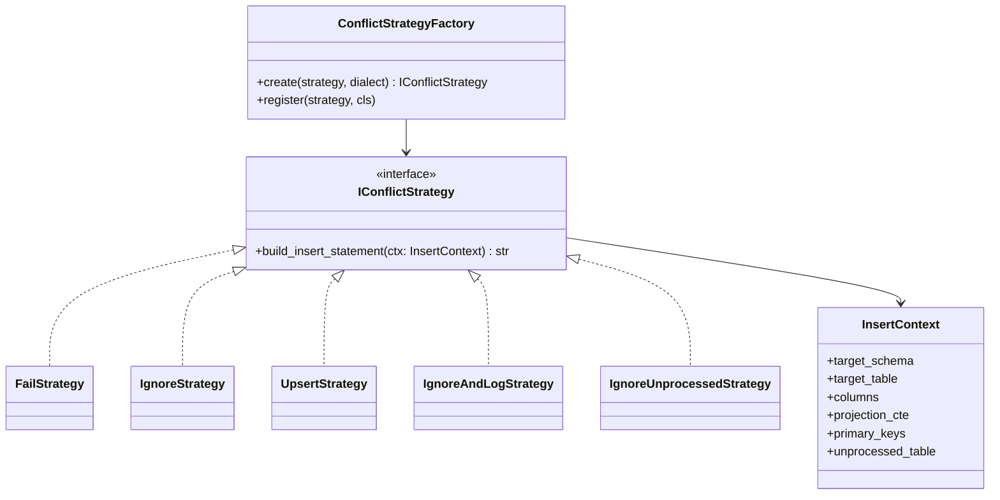
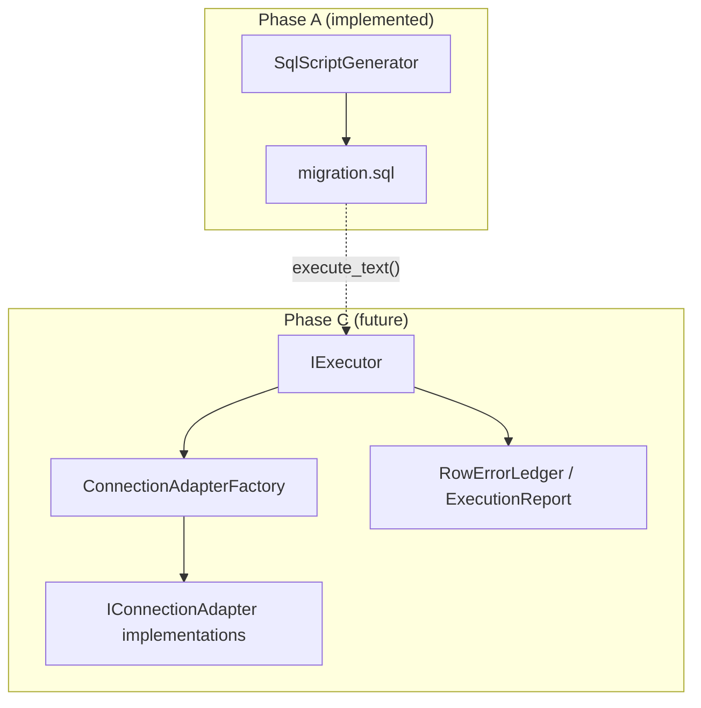
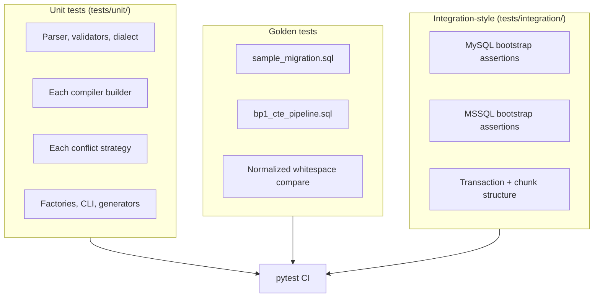

# Data Migration Engine — Architecture Document

**Version:** 1.0.0  
**Status:** Reflects implemented codebase (Phases 0–7 complete)  
**Audience:** Technical architects, development team, client stakeholders  
**Related:** [REQUIREMENTS.md](REQUIREMENTS.md) · [source-bootstrap-patterns.md](source-bootstrap-patterns.md) · [executor-streaming-design.md](executor-streaming-design.md)

---

## 1. Purpose of This Document

This document describes **how the Migration Engine is built and how it behaves**, based on the current implementation. It is intended for:

| Audience | What you will find here |
|----------|-------------------------|
| **Clients** | What the product does, what you provide, what you receive, and how migrations run |
| **Technical architects** | System boundaries, layering, extension points, and design pattern choices |
| **Development team** | Module map, compilation pipeline, naming conventions, and where to add features |

Functional requirements and acceptance criteria remain in [REQUIREMENTS.md](REQUIREMENTS.md).

---

## 2. Executive Summary (Clients)

The **Migration Engine** is a configuration-driven ELT tool. A client (or integration partner) supplies a **JSON migration blueprint** describing:

- Source systems (MySQL, SQL Server, PostgreSQL, S3 CSV)
- Target tables and column mappings
- Transformations, filters, joins, and conflict handling
- Optional chunking for large datasets

The engine **validates** that blueprint and **generates a single, self-contained MySQL SQL script**. When that script is executed on the target MySQL database, it:

1. Bootstraps remote sources into temporary staging tables
2. Runs a CTE-based transformation pipeline per blueprint step
3. Loads results into target tables with configurable duplicate-key behavior
4. Commits each blueprint step independently (transaction + savepoint)

**v1 delivers SQL generation only (Phase A).** Python-side execution (Phase C) is architected but not yet implemented — interfaces and stubs are in place so future work does not require restructuring.



---

## 3. System Context

### 3.1 In scope (implemented — Phase A)

| Capability | Description |
|------------|-------------|
| JSON parsing | Blueprint → immutable Pydantic DTOs |
| Fail-fast validation | Schema, expression whitelist, connectivity matrix |
| SQL compilation | MySQL dialect; one script per migration |
| Multi-source bootstrap | Preamble SQL per source connection type |
| CTE pipeline | Staging → filters → joins → derivations → projection → INSERT |
| Conflict strategies | FAIL, IGNORE, UPSERT, IGNORE_AND_LOG, IGNORE_AND_INSERT_UNPROCESSED |
| Chunking | WHILE loop with chunk variables in generated SQL |
| Transactions | START TRANSACTION + SAVEPOINT per blueprint `sequence_order` |
| CLI | `validate` and `generate` commands |
| Tests | 98+ unit, golden-file, and integration-style tests |

### 3.2 Out of scope (v1)

| Item | Notes |
|------|-------|
| Web UI / wizard | Backend-first; API/UI deferred |
| Python executor | Stubbed; see Phase C |
| Live DB execution in CI | Integration tests verify SQL structure, not testcontainers |
| PostgreSQL target dialect | Factory ready; only MySQL implemented |

### 3.3 Future (Phase C — reserved)

- `IConnectionAdapter` implementations for streaming reads
- `IExecutor` for running scripts with batch telemetry and row-level error ledger
- Optional hybrid: SQL preamble + Python staging fallback

See [executor-streaming-design.md](executor-streaming-design.md).

---

## 4. High-Level Architecture

The system follows a **layered, interface-driven** design. Each layer has a single reason to change and depends on abstractions, not concrete SQL details.



---

## 5. End-to-End Processing Flow

### 5.1 Validate command

```
JSON file → BlueprintParser → MasterMigrationBlueprint
         → MigrationConfigValidator
              → SchemaValidator
              → ExpressionValidator (YAML whitelist)
              → ConnectivityValidator
         → ValidationReport (summary + JSON)
         → optional --report-file export
```

Exit codes: `0` success · `1` validation failure · `2` parse failure

### 5.2 Generate command

```
JSON file → BlueprintParser
         → ScriptGeneratorFactory.create(output_format, dialect)
         → SqlScriptGenerator.generate()
              → MigrationConfigValidator (fail-fast)
              → DialectFactory → MySqlDialect
              → MigrationCompiler.compile_migration()
         → write output/migration.sql
```

Generation never proceeds if validation fails. Errors include a human-readable summary and JSON report.

---

## 6. Per-Blueprint Compilation Pipeline

Each blueprint (`sequence_order` 1, 2, 3, …) compiles to an independent SQL block. `MigrationCompiler` orchestrates specialized builders — it does not embed SQL logic directly.



### 6.1 CTE naming convention

All CTE names are prefixed by blueprint `sequence_order` via `CteNaming`:

| Stage | CTE name pattern | Example (blueprint 2) |
|-------|------------------|-------------------------|
| Staging | `bp{N}_stg_{alias}` | `bp2_stg_tih` |
| Chunk filter | `bp{N}_chunk_filtered` | `bp2_chunk_filtered` |
| Pre-filter | `bp{N}_pre_filtered_{root}` | `bp2_pre_filtered_tih` |
| Joined | `bp{N}_joined_{root}` | `bp2_joined_tih` |
| Derivations | `bp{N}_calculation_layer` | `bp2_calculation_layer` |
| Post-filter | `bp{N}_filtered_results` | `bp2_filtered_results` |
| Projection | `bp{N}_target_projection` | `bp2_target_projection` |

Bootstrap temp tables use `_bootstrap_{alias}` (not prefixed by blueprint — unique per alias within a blueprint).

Savepoints use `bp_step_{N}`.

### 6.2 Multi-blueprint orchestration

`compile_migration()` sorts blueprints by `sequence_order`, compiles each independently, and joins blocks with a script header:

```sql
-- Migration: mig_multi_server_enterprise_2026
-- Client: client_global_retail_corp

[Blueprint 1 block: START TRANSACTION … COMMIT]

[Blueprint 2 block: chunk setup + WHILE loop … COMMIT]

[Blueprint 3 block: … COMMIT]
```

Each step commits independently. A failure in step N does not roll back completed steps 1..N-1.

---

## 7. Source Bootstrap Architecture

Remote sources are not queried inline in CTEs. The generated script first materializes each source into a **temporary bootstrap table**, then CTEs read from those tables.



**Operational prerequisite:** DBAs must provision federated/bridge schemas (`fed_{connection_ref}`) before running the script. See [source-bootstrap-patterns.md](source-bootstrap-patterns.md).

`connection_string_parser.py` extracts host, port, database, and credentials for `SET` variable emission.

---

## 8. Module Reference

```
src/migration_engine/
├── __main__.py                 CLI: validate, generate
├── models/                     Frozen Pydantic DTOs and enums
├── parsers/                    JSON → DTOs
├── validators/                 Fail-fast config validation + report export
├── generators/                 IScriptGenerator, SqlScriptGenerator
├── factories/                  Registry-based object creation
├── dialects/                   BaseDialect, MySqlDialect
├── strategies/conflict/        on_conflict INSERT variants
├── compilers/
│   ├── migration_compiler.py   Top-level orchestrator
│   ├── cte_pipeline_builder.py CTE stage chain
│   ├── cte_naming.py           Deterministic naming
│   ├── mapping_resolver.py     Mapping → SQL expressions
│   ├── join_clause_builder.py  JOIN SQL fragments
│   ├── chunking_procedural_builder.py
│   ├── transaction_builder.py
│   └── bootstrap/              Per-source-type preamble strategies
├── adapters/                   Phase C — IConnectionAdapter stubs
├── executor/                   Phase C — IExecutor stubs
└── logging/                    structlog JSON setup
```

### 8.1 Module responsibility matrix

| Module | Responsibility | Must NOT |
|--------|----------------|----------|
| `models/` | Immutable data contracts | SQL, I/O |
| `parsers/` | Deserialize JSON | Business validation, SQL |
| `validators/` | Rules + whitelist enforcement | SQL generation |
| `dialects/` | Dialect-specific SQL fragments | Orchestration, file I/O |
| `compilers/` | Pipeline orchestration | Hardcoded dialect keywords |
| `generators/` | Validate-then-compile entry | Parse JSON directly in CLI |
| `factories/` | Registry lookup / creation | Domain logic |
| `strategies/conflict/` | INSERT statement variants | CTE construction |
| `adapters/` | Future DB/file streaming | SQL compilation |
| `executor/` | Future script execution | Config parsing |

---

## 9. Design Patterns Catalog

The implementation applies standard patterns deliberately. Each pattern is tied to a concrete feature.

| Pattern | Where used | Feature / benefit |
|---------|------------|-------------------|
| **Factory Method** | `ScriptGeneratorFactory`, `DialectFactory`, `ConflictStrategyFactory`, `BootstrapStrategyFactory`, `ConnectionAdapterFactory` | Select implementation by config key (`output_format`, dialect, `on_conflict`, connection type) without changing callers |
| **Strategy** | `IConflictStrategy` (+ 5 implementations) | Swap INSERT behavior per blueprint `on_conflict` |
| **Strategy** | `ISourceBootstrapStrategy` (+ 4 implementations) | Different preamble SQL per source connection type |
| **Template Method** (conceptual) | `CtePipelineBuilder.build()` | Fixed CTE stage sequence; subclasses/stages vary content |
| **Builder** | `CtePipelineBuilder`, `TransactionBuilder`, `ChunkingProceduralBuilder` | Assemble complex SQL from atomic steps |
| **Facade** | `MigrationCompiler`, `SqlScriptGenerator`, `MigrationConfigValidator` | Single entry point hiding sub-system coordination |
| **DTO / Value Object** | Pydantic frozen models, `CteNaming`, `GeneratedScript`, `ValidationReport` | Immutable config graph; safe sharing across layers |
| **Registry** | All `Factory._registry` dicts + `register()` | Open/closed — extend without modifying factory code |
| **Dependency Inversion** | `BaseDialect`, `IScriptGenerator`, `IConflictStrategy`, `IConnectionAdapter`, `IExecutor` | Compilers depend on abstractions; MySQL is one plug-in |
| **Chain of Responsibility** (conceptual) | `MigrationConfigValidator` → schema → expression → connectivity | Sequential validation passes; first failures aggregated |
| **Null Object** (conceptual) | `StubConnectionAdapter`, `StubExecutor` | Explicit Phase C placeholders with clear `NotImplementedError` |

### 9.1 SOLID mapping

| Principle | Application |
|-----------|-------------|
| **S** — Single Responsibility | Each validator, builder, and strategy class has one job (e.g. `TransactionBuilder` only wraps savepoints) |
| **O** — Open/Closed | New dialects, conflict strategies, bootstrap types, and output formats via `register()` |
| **L** — Liskov Substitution | All strategies honor `IConflictStrategy.build_insert_statement(ctx)` contract |
| **I** — Interface Segregation | Separate interfaces for generation, dialect, conflict, bootstrap, adapter, executor |
| **D** — Dependency Inversion | `MigrationCompiler` accepts `BaseDialect`; never imports `MySqlDialect` directly |

---

## 10. Key Feature → Component Map

| Feature | Primary components |
|---------|-------------------|
| JSON config intake | `BlueprintParser`, `models/blueprint.py` |
| Expression safety | `ExpressionValidator`, `config/whitelists/mysql_expressions.yaml` |
| Multi-tenant identity | `migration_id`, `client_id` in DTO + script header |
| MySQL safe cast | `MySqlDialect.safe_cast()` |
| UPSERT | `UpsertStrategy` + `MySqlDialect.on_duplicate_key_update()` |
| Derivation refs (`derivations.xxx`) | `MappingResolver`, `calculation_layer` CTE |
| Join conditions | `JoinClauseBuilder`, `joined_{root}` CTE |
| Large table chunking | `ChunkingProceduralBuilder`, `bp{N}_chunk_filtered` CTE |
| Per-step commit | `TransactionBuilder` + `MySqlDialect` transaction keywords |
| Multi-source union scenario | Multiple bootstrap preambles + shared target UPSERT (blueprint 3) |
| Validation JSON export | `ValidationReport.to_dict()`, `report_writer.py`, CLI `--report-file` |
| Structured logging | `logging/structured_logger.py` (structlog) |

---

## 11. Conflict Strategy Architecture



| Strategy | Generated SQL behavior |
|----------|------------------------|
| `FAIL` | Plain `INSERT` — duplicate key errors propagate |
| `IGNORE` | `INSERT IGNORE` |
| `UPSERT` | `INSERT … ON DUPLICATE KEY UPDATE` |
| `IGNORE_AND_LOG` | `INSERT IGNORE` + audit logging SQL |
| `IGNORE_AND_INSERT_UNPROCESSED` | Route rejected rows to `unprocessed_table` |

---

## 12. Phase C Extension Architecture (Reserved)

Phase C adds a **runtime execution path** parallel to script-only delivery. No compiler changes are required.



Current stubs:

- `StubConnectionAdapter` — raises `NotImplementedError` on `connect()` / `fetch_batch()`
- `StubExecutor` — raises on `execute()` / `stream_batches()`
- `ConnectionAdapterFactory` — returns stubs; supports `register()` for real adapters

---

## 13. CLI & Operations

### 13.1 Commands

```bash
cd script-generator
py -m migration_engine validate --config ../docs/sampleConfigfile.json
py -m migration_engine validate --config ../docs/sampleConfigfile.json --report-file output/validation.json
py -m migration_engine generate --config ../docs/sampleConfigfile.json --output output/migration.sql --dialect MYSQL
```

### 13.2 Client operational checklist

1. **Author** migration JSON (or generate from a future UI)
2. **Validate** — fix all reported issues before generation
3. **Generate** SQL script
4. **Provision** federated bridge tables (`fed_{connection_ref}`) on MySQL target
5. **Review** embedded credentials in `SET` statements (security)
6. **Execute** script on MySQL target during a maintenance window
7. **Verify** row counts and spot-check target tables per blueprint

### 13.3 Idempotency

Conflict strategy drives re-run safety:

- `UPSERT` — updates existing keys
- `IGNORE` — skips duplicates
- `FAIL` — stops on duplicate (savepoint rollback for that step)

---

## 14. Testing Architecture



| Level | Purpose | Location |
|-------|---------|----------|
| Unit | Isolated logic, fast feedback | `tests/unit/` |
| Golden | Full SQL regression — any CTE structure change updates golden explicitly | `tests/golden/expected/` |
| Integration-style | Assert generated SQL contains correct bootstrap, chunking, transaction patterns | `tests/integration/` |

**Note:** Live testcontainers execution against MySQL/MSSQL is documented in REQUIREMENTS as a future CI enhancement; current integration tests validate **SQL structure**, not database connectivity.

---

## 15. Technology Stack

| Concern | Choice |
|---------|--------|
| Language | Python 3.11+ |
| Data validation | Pydantic v2 (frozen models) |
| CLI | Typer |
| Logging | structlog (JSON) |
| Expression whitelist | YAML (`config/whitelists/`) |
| Testing | pytest |
| Linting | ruff |
| Packaging | hatchling (`pyproject.toml`) |

All dependencies are open source.

---

## 16. Implementation Status

| Phase | Scope | Status |
|-------|-------|--------|
| 0 | Foundation, models, ABCs, factories | [x] Complete |
| 1 | Parser + validators + CLI validate | [x] Complete |
| 2 | MySQL dialect + conflict strategies | [x] Complete |
| 3 | CTE pipeline compiler | [x] Complete |
| 4 | Source bootstrap + multi-source | [x] Complete |
| 5 | Chunking + transactions + full migration compile | [x] Complete |
| 6 | SqlScriptGenerator + CLI generate | [x] Complete |
| 7 | Phase C stubs, integration tests, validation export | [x] Complete |
| 8 | Python executor, real adapters, PG dialect, UI API | [ ] Future |

---

## 17. How to Extend (Development Team)

| Extension | Steps |
|-----------|-------|
| New target dialect | Implement `BaseDialect` → `DialectFactory.register()` → add connectivity rules in `ConnectivityValidator` |
| New `on_conflict` strategy | Implement `IConflictStrategy` → `ConflictStrategyFactory.register()` |
| New source type | Implement `ISourceBootstrapStrategy` → `BootstrapStrategyFactory.register()` → extend `ConnectionType` enum and models |
| New output format | Implement `IScriptGenerator` → `ScriptGeneratorFactory.register()` |
| Phase C adapter | Implement `IConnectionAdapter` → `ConnectionAdapterFactory.register()` |
| Phase C executor | Implement `IExecutor` replacing `StubExecutor` |

**Rule:** Never add SQL string logic to validators or parsers. Never add validation logic to compilers.

---

## 18. Sample Migration Structure

The reference config `../../docs/sampleConfigfile.json` exercises:

| Blueprint | Sources | Notable features |
|-----------|---------|------------------|
| 1 | MySQL CRM + S3 CSV join | Pre-filters, derivations, UPSERT |
| 2 | MSSQL billing + PostgreSQL POS | Chunking WHILE loop, complex CASE join key |
| 3 | S3 archival append | Multi-source UNION into same target, UPSERT dedup |

Golden output: `tests/golden/expected/sample_migration.sql` (274 lines).

---

## 19. Security & Multi-Tenancy Notes

- **Multi-tenant:** `client_id` and `migration_id` are carried in config and script header for auditability
- **Credentials:** Generated SQL embeds connection params in `SET` variables for self-contained execution — production deployments should inject secrets externally or use read-only bridge accounts
- **Expression injection:** Mitigated by whitelist validation before any SQL is emitted
- **Fail-fast:** Invalid configs never produce SQL

---

## 20. Related Documents

| Document | Purpose |
|----------|---------|
| [REQUIREMENTS.md](REQUIREMENTS.md) | Full functional spec, phases, success criteria |
| [INTEGRATION.md](../../docs/INTEGRATION.md) | Cross-product APIs and contracts |
| [source-bootstrap-patterns.md](source-bootstrap-patterns.md) | Federated schema naming and ops prerequisites |
| [executor-streaming-design.md](executor-streaming-design.md) | Migrator streaming design notes |
| [codeSanityInstructionsToAI.md](codeSanityInstructionsToAI.md) | Engineering principles for contributors |
| [README.md](../../README.md) | Platform overview |
| [script-generator README.md](../README.md) | Generator quick start |

---

*This architecture document is maintained alongside the codebase. Update it when adding new factories, compilers, or Phase C implementations.*
